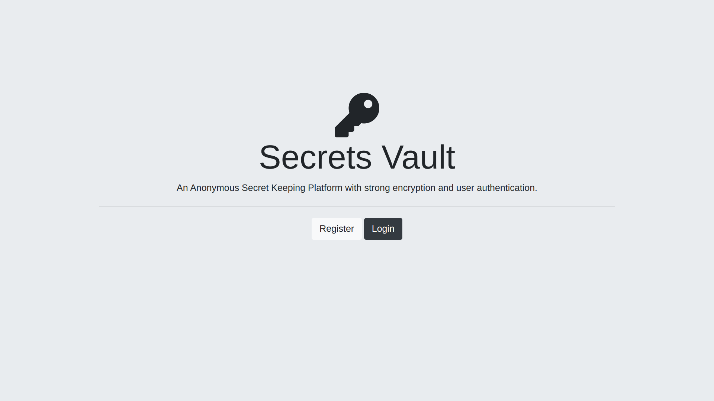
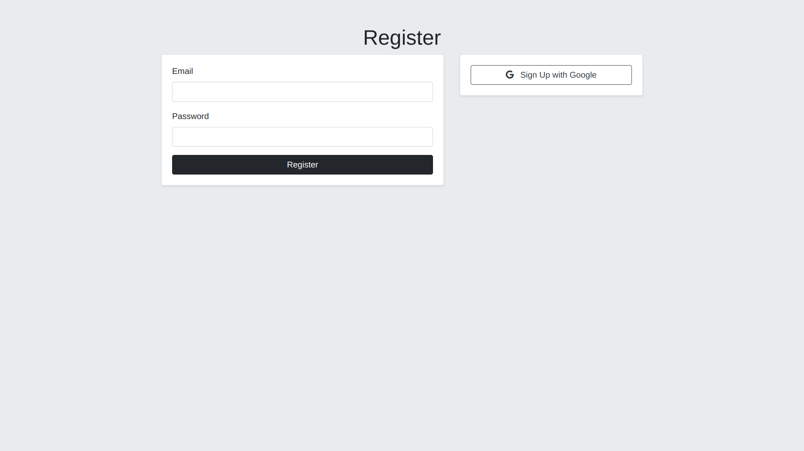
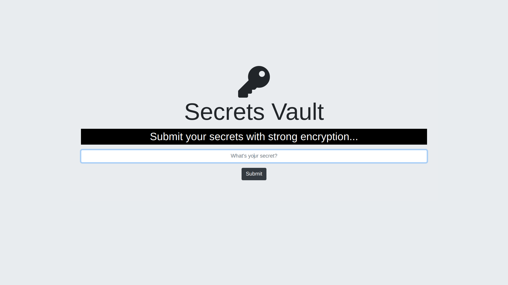

# Secrets Web Application





## Table of Contents

- [Introduction](#introduction)
- [Features](#features)
- [Technologies Used](#technologies-used)
- [Installation](#installation)
- [Usage](#usage)
- [Project Structure](#project-structure)
- [Contributing](#contributing)
- [Contact](#contact)

## Introduction

The Secrets Web Application is a full-stack web app where users can share their secrets anonymously. It implements user authentication using Passport.js, allowing users to register, log in, and submit their secrets. Users can also log in using their Google accounts through Google OAuth 2.0.

## Features

- User authentication with email and password.
- Google OAuth 2.0 authentication.
- Secure password storage using bcrypt.
- Session management with express-session.
- PostgreSQL database integration.
- Responsive design with Bootstrap.
- Secrets submission and display.

## Technologies Used

- **Frontend**:
  - HTML
  - CSS (Bootstrap)
  - EJS (Embedded JavaScript Templates)
- **Backend**:
  - Node.js
  - Express.js
  - Passport.js (local and Google strategies)
- **Database**:
  - PostgreSQL
- **Other**:
  - bcrypt
  - dotenv
  - express-session
  - Google OAuth 2.0

## Installation

Follow these steps to get a local copy of the project up and running:

1. Clone the repository:
   ```bash
   git clone https://github.com/your-username/secrets-web-app.git
   ```
2. Navigate to the project directory:
   ```bash
   cd secrets-web-app
   ```
3. Install the dependencies:

   ```bash
   npm install
   ```

4. Set up environment variables by creating a `.env` file in the root directory:

   ```
   SESSION_SECRET=yourSessionSecret
   PG_USER=yourDatabaseUser
   PG_HOST=yourDatabaseHost
   PG_DATABASE=yourDatabaseName
   PG_PASSWORD=yourDatabasePassword
   PG_PORT=yourDatabasePort
   GOOGLE_CLIENT_ID=yourGoogleClientID
   GOOGLE_CLIENT_SECRET=yourGoogleClientSecret
   ```

5. Start the application:
   npm start

   ```

   ```

6. Open your browser and visit `http://localhost:3000` to see the application in action.

## Usage

- Visit the homepage to explore the application.
- Register a new account or log in using an existing account.
- Submit your secrets anonymously.
- View secrets shared by others.

## Project Structure

```
.
├── public/              # Static assets (CSS, JS, images)
├── views/               # EJS templates
│   ├── partials/        # Header and footer partials
│   ├── home.ejs         # Home page
│   ├── login.ejs        # Login page
│   ├── register.ejs     # Registration page
│   ├── secrets.ejs      # Secrets display page
│   ├── submit.ejs       # Secret submission page
├── .env                 # Environment variables
├── index.js             # Main application file
├── package.json         # NPM dependencies and scripts
└── README.md            # Project documentation
```

## Contributing

Contributions are welcome! Please open an issue or submit a pull request for any improvements or suggestions.

## Contact

For any inquiries or feedback, feel free to reach out:

- **Name**: Adarsh Raj
- **Email**: adarshraj6113@gmail.com
